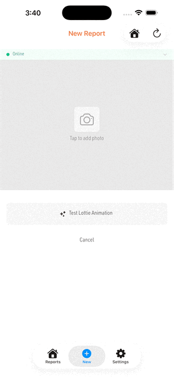

# LottieForm

A NativePHP Mobile plugin that displays native Lottie animation overlays from PHP/Livewire.

Show success checkmarks, celebration effects, loading spinners, or any `.lottie` animation as a fullscreen overlay on top of your app's WebView. Animations render natively on both iOS and Android with smooth fade-in, tap-to-dismiss, auto-close, and full control over size, position, and background color.

Drop your `.lottie` files in `resources/animations/`, call the fluent PHP API, and you're done.

| Checked |
|:---:|
|  |
| `checked.lottie` |

## Installation

```bash
composer require codemountain/mobile-lottie-form
```

Register the plugin:

```bash
# Register the plugin
php artisan native:plugin:register codemountain/mobile-lottie-form

# Verify registration
php artisan native:plugin:list
```

## Publishing Animations

This plugin includes a bundled `checked.lottie` animation (a checkmark success animation). Publish it to your project:

```bash
# Publish animations only
php artisan vendor:publish --tag=lottie-form-animations

# Publish everything
php artisan vendor:publish --tag=lottie-form
```

This copies the bundled animations to `resources/animations/`.

## Adding Animations

Place your `.lottie` files in `resources/animations/` (alongside any published ones):

```
resources/
  animations/
    checked.lottie    ← published from plugin
    success.lottie    ← your own
    confetti.lottie   ← your own
```

All `.lottie` files in this directory are automatically copied to both iOS and Android builds at compile time.

### Custom Animations Directory

To use a different directory, set `LOTTIE_FORM_ANIMATIONS` in your `.env`:

```env
LOTTIE_FORM_ANIMATIONS=resources/lottie
```

Falls back to `resources/animations` if unset or the path doesn't exist.

## Usage

### PHP (Livewire/Blade)

```php
use CodeMountain\LottieForm\Facades\LottieForm;

// Simple — show and auto-dismiss after one play cycle
LottieForm::show('checked.lottie')->play();

// Customized
LottieForm::show('checked.lottie')
    ->backgroundColor('#F26E3680')
    ->size(0.6)
    ->position('center')
    ->fadeInDuration(900)
    ->autoClose()
    ->tapToDismiss()
    ->id('report-success')
    ->play();

// Looping animation with manual dismiss
LottieForm::show('loading.lottie')
    ->looping()
    ->autoClose(false)
    ->tapToDismiss(false)
    ->play();

// Dismiss programmatically
LottieForm::dismiss();
```

### JavaScript (Vue/React/Inertia)

```javascript
import { lottieForm } from '@codemountain/mobile-lottie-form';

// Simple
await lottieForm.show('checked.lottie').play();

// Customized
await lottieForm.show('checked.lottie')
    .backgroundColor('#F26E3680')
    .size(0.6)
    .position('center')
    .fadeInDuration(900)
    .autoClose()
    .tapToDismiss()
    .id('report-success')
    .play();

// Dismiss
await lottieForm.dismiss();
```

## Configuration Options

| Method | Default | Description |
|---|---|---|
| `backgroundColor(string)` | `#00000080` | Overlay background color (hex, supports alpha) |
| `size(float)` | `0.4` | Animation size relative to screen width (0.1 - 1.0) |
| `position(string)` | `center` | Vertical position: `center`, `top`, or `bottom` |
| `fadeInDuration(int)` | `300` | Fade-in duration in milliseconds |
| `autoClose(bool)` | `true` | Dismiss automatically after one play cycle |
| `looping(bool)` | `false` | Loop the animation continuously |
| `duration(int)` | `null` | Auto-dismiss after N milliseconds (independent of animation) |
| `tapToDismiss(bool)` | `true` | Allow tapping the overlay to dismiss |
| `fullScreen(bool)` | `false` | Expand animation to fill the entire screen |
| `id(string)` | auto-generated | Identifier returned in events to track which animation completed |
| `textField(string, string)` | none | Replace a named text layer in the animation |

## Full Screen

Use `fullScreen()` to expand the animation to fill the entire viewport. Without it, the animation is constrained to a square based on `size()` (fraction of screen width). With `fullScreen()`, the animation view is pinned to all edges of the screen while maintaining its aspect ratio.

```php
LottieForm::show('celebration.lottie')
    ->fullScreen()
    ->fadeInDuration(600)
    ->autoClose()
    ->play();
```

```javascript
await lottieForm.show('celebration.lottie')
    .fullScreen()
    .fadeInDuration(600)
    .autoClose()
    .play();
```

> When `fullScreen()` is enabled, `size()` and `position()` are ignored.

## Dynamic Text

If your `.lottie` file contains named text layers, you can replace their content at runtime. Ask your designer to name text layers in After Effects (e.g. `title`, `subtitle`, `message`).

```php
LottieForm::show('success-with-text.lottie')
    ->textField('title', 'Report Created!')
    ->textField('subtitle', 'Syncing now...')
    ->size(0.6)
    ->autoClose()
    ->play();
```

```javascript
await lottieForm.show('success-with-text.lottie')
    .textField('title', 'Report Created!')
    .textField('subtitle', 'Syncing now...')
    .play();
```

Text layers without a matching `textField()` call keep their default value from the animation file.

## Custom Fonts

Lottie animations may reference custom fonts (e.g. a designer uses "TikTok Sans" in After Effects). If the font isn't bundled, the plugin falls back to the system default font (Helvetica Neue on iOS, Roboto on Android) so the app never crashes.

To bundle custom fonts so they render correctly:

1. Place `.ttf` or `.otf` files in `resources/animations/fonts/`:

```
resources/
  animations/
    success.lottie
    fonts/
      TikTok Sans.ttf    ← matches the font family name in the .lottie file
      CustomFont.otf
```

2. That's it. The build hook copies fonts to the correct location on each platform:
   - **Android**: `assets/fonts/` (Lottie's default lookup path)
   - **iOS**: App bundle (registered at runtime via CoreText)

> The font filename must match the font family name referenced in the `.lottie` file. Open the `.lottie` (or source `.json`) and look for `"fFamily"` values to find the exact name.

## Events

### AnimationStarted

Fired when the overlay appears and the animation begins playing.

```php
use Native\Mobile\Attributes\OnNative;
use CodeMountain\LottieForm\Events\AnimationStarted;

#[OnNative(AnimationStarted::class)]
public function handleAnimationStarted(string $animationPath, ?string $id = null): void
{
    // Overlay is now visible
}
```

### AnimationCompleted

Fired when the animation is dismissed for any reason.

```php
use Native\Mobile\Attributes\OnNative;
use CodeMountain\LottieForm\Events\AnimationCompleted;

#[OnNative(AnimationCompleted::class)]
public function handleAnimationCompleted(string $reason, ?string $id = null): void
{
    // $reason: 'completed', 'tapped', 'timeout', 'programmatic', or 'error'
}
```

## Example: Success Animation After Form Submit

```php
use CodeMountain\LottieForm\Events\AnimationCompleted;
use CodeMountain\LottieForm\Facades\LottieForm;

public function submit(): void
{
    // ... save data ...

    LottieForm::show('checked.lottie')
        ->backgroundColor('#F26E3680')
        ->size(0.6)
        ->fadeInDuration(600)
        ->autoClose()
        ->id('form-success')
        ->play();
}

#[OnNative(AnimationCompleted::class)]
public function handleAnimationCompleted(string $reason, ?string $id = null): void
{
    if ($id === 'form-success') {
        $this->redirect(route('home'), navigate: false);
    }
}
```

## Native Dependencies

| Platform | Package | Version |
|---|---|---|
| iOS | [lottie-spm](https://github.com/airbnb/lottie-spm) | 4.6.0 |
| Android | [lottie-compose](https://github.com/airbnb/lottie-android) | 6.7.1 |

## Acknowledgements

Inspired by [atum/nativephp-loader](https://github.com/atumco/nativephp-loader), which provides Lottie-powered splash screens for NativePHP apps. LottieForm extends the concept to runtime overlays triggered from PHP.

## License

MIT

## Support
support@codemountain.ca
